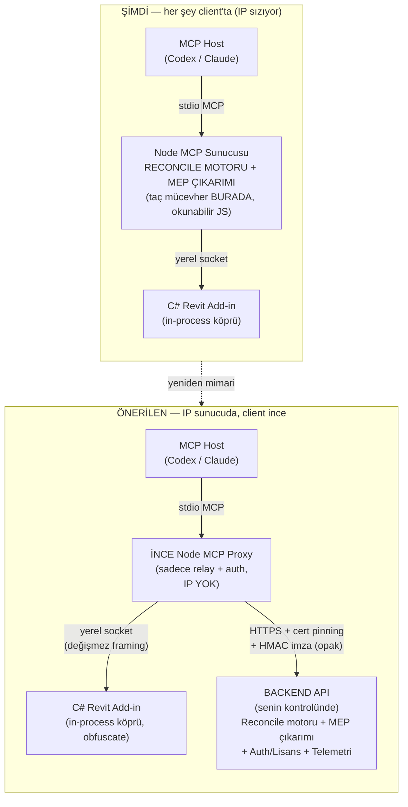
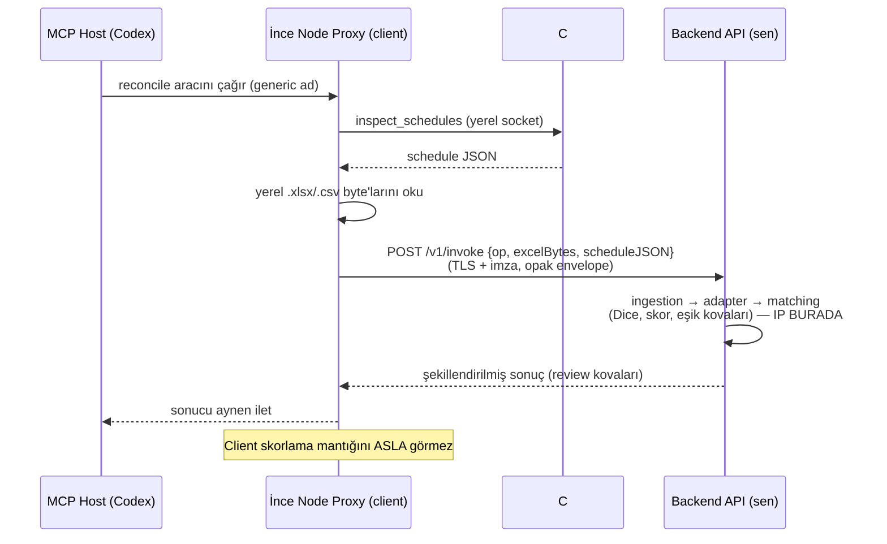
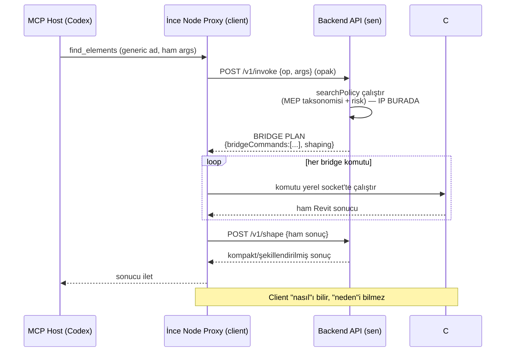
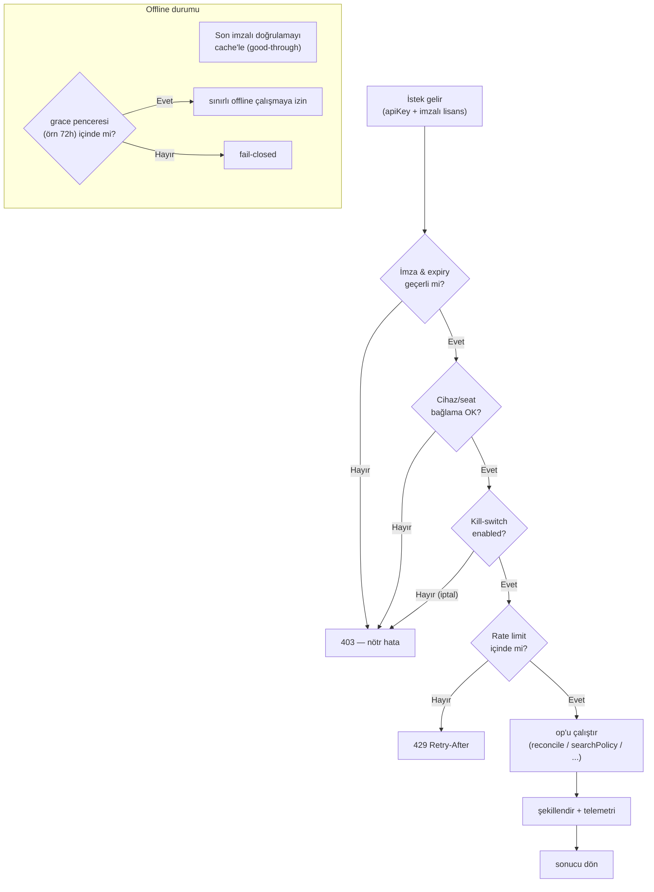
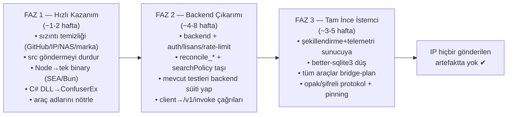

# revAgent — Önerilen Mimari (Workflow Görselleri)

Aşağıdaki diyagramlar, IP'yi (taç-mücevher mantığı) sunucuya taşıyıp client'ı
"ince relay"e indiren önerilen mimariyi adım adım gösterir.

---

## 1) Genel Topoloji — ŞİMDİ vs ÖNERİLEN

---

## 2) Saf-IP Akışı — `reconcile` (skorlama sunucuda)

Burada Revit API'sine dokunulmaz; veri toplanır, sunucuya gider, sonuç döner.

---

## 3) Revit'e Dokunan Akış — `find_elements` ("bridge plan" modeli)

Karar (hangi kategori/eşik) sunucuda; client sadece komutu çalıştıran el.

---

## 4) Auth / Lisans / Kill-Switch Kapısı

Her çağrı backend'de doğrulanır; iptal/expired/offline-grace burada yönetilir.

---

## 5) Göç Fazları (Yol Haritası)

---

## 6) IP Bölümleme — Tek Bakışta

```mermaid
flowchart LR
    subgraph SRV["SUNUCUYA TAŞINIR (yüksek IP, Revit'ten bağımsız)"]
        S1["reconcile_matching.ts<br/>(skorlama/kovalar)"]
        S2["reconcile_normalization.ts"]
        S3["reconcile_excel_ingestion.ts"]
        S4["reconcile_schedule_adapter.ts"]
        S5["searchPolicy.ts<br/>(MEP taksonomisi/risk)"]
        S6["sonuç şekillendirme<br/>broadScanResult / responseMode"]
        S7["telemetri toplama"]
    end
    subgraph CLI["CLIENT'TA KALIR (plumbing, obfuscate)"]
        K1["C# Revit add-in<br/>(in-process zorunlu)"]
        K2["Roslyn send_code_to_revit"]
        K3["element/view/schedule C# komutları"]
        K4["İnce Node proxy<br/>(SocketClient + sendRevitCommand)"]
    end
    CLI -. "HTTPS opak çağrı" .-> SRV
```

